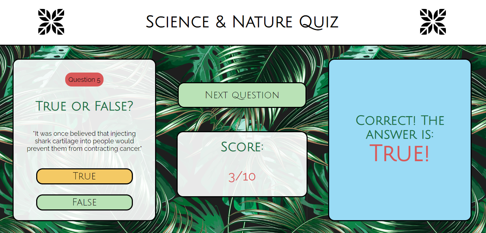

# Quiz App

###### June 2020

_I am really pleased with how quickly I managed to create this quiz. It was pretty much a one day project and processes / design ideas that used to take me quite a while, now seem much easier. It feels good to be able to code faster and more cleanly, and it confirms how much I've learnt over the past few months. I think it has great functionality and I'm also really happy with the design of it. There are no brand new concepts used in this project but it has allowed me to consolidate a lot of the learning I've done over the past few weeks which has been really useful._

### Main Learning Points:

- I used fetch() to get the information from the quiz API. Although I've used fetch() before (in the Kanye West Quote Generator) it was much easier to display / format the data I received back in that project because it only sent me one quote at a time. All I had to do in that instance was display the whole object / all the data at once. This quiz API gave me back a JavaScript object with the questions and answers to ten questions which I obviously did not want to show all at once. So I accessed the object properties and displayed the questions / answers seperately and used a variable called index (var index = 0) which I used to display one question at at time (index + 1 after each question).

- I made a true / false style of quiz in which the user selects which answer they want by pressing a true or false button which changes color when selected. This worked perfectly to start with until my partner pressed both buttons (he 'changed his mind'...) and it broke. Both buttons changed color and then the first answer was taken as the users answer, therefore resulting in the wrong answer. So I had to make the app 'user accident proof!' and made it so only one button could change color at once and the last answer selected was the one carried forward. This was a good lesson in user experience / making the app more robust.

- I used some animation on the pop-up final score box which I think is really effective. I hadn't done this for a while so it was a good refresher.

- I'm really happy with the visual design of the app and feel very confident using CSS and flexbox now.
